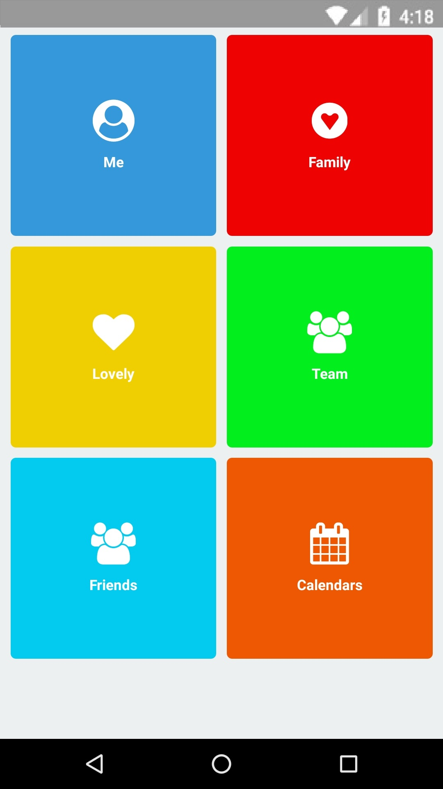

# React Native: Dashboard

[](https://github.com/gaetanozappi/react-native-dashboard)
[](https://github.com/gaetanozappi/react-native-dashboard/issues)



-   [Usage](#usage)
-   [License](#license)

## Usage

```javascript
import React, { Component } from 'react';
import { Text, View, StyleSheet } from 'react-native';
import Dashboard from 'react-native-dashboard';

const items = [
  { name: 'Me', background: '#3498db', icon: 'user-dashboard' },
  { name: 'Family', background: '#ef0202', icon: 'gratipay' },
  { name: 'Lovely', background: '#efcf02', icon: 'heart' },
  { name: 'Team', background: '#02ef1d', icon: 'users' },
  { name: 'Friends', background: '#02cbef', icon: 'group' },
  { name: 'Calendars', background: '#ef5802', icon: 'calendar' },
];

export default class App extends Component {
  _card = el => {
    console.log('Card: ' + el.name)
  };
  render() {
    return (
      <View style={styles.container}>
        <Dashboard items={items} background={true} card={this._card} column={2} />
      </View>
    );
  }
}

const styles = StyleSheet.create({
  container: {
    flex: 1,
    backgroundColor: '#ecf0f1',
  },
});
```

## License
This library is provided under the Apache License.
